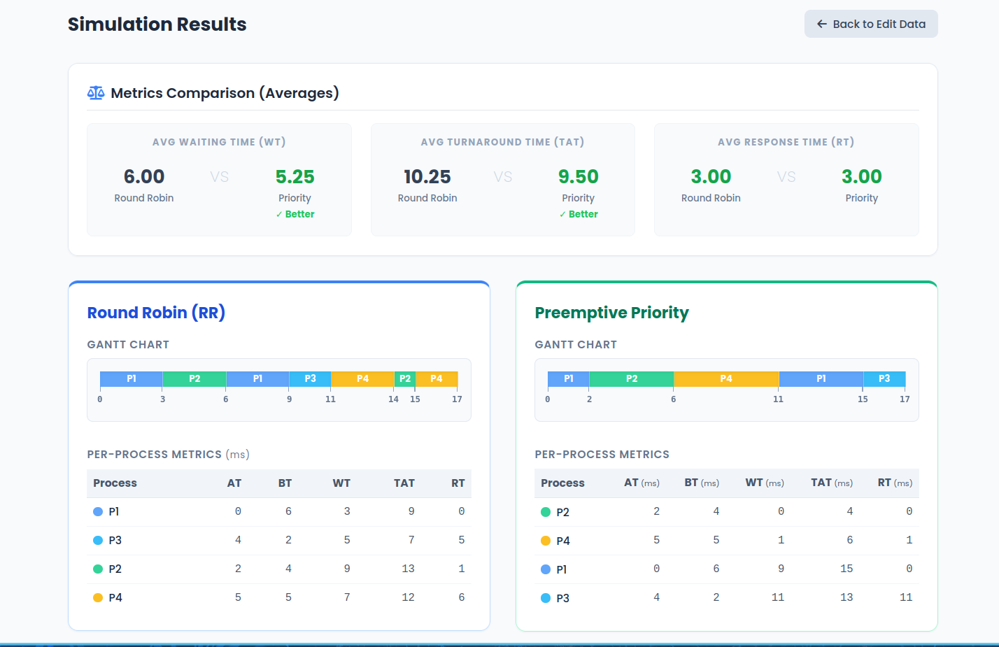
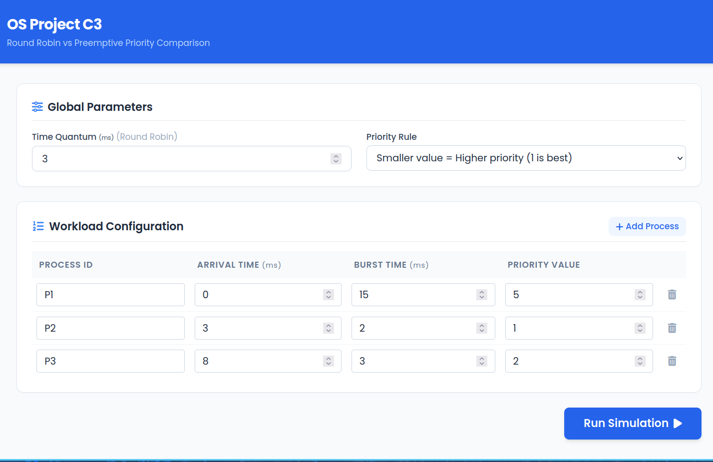
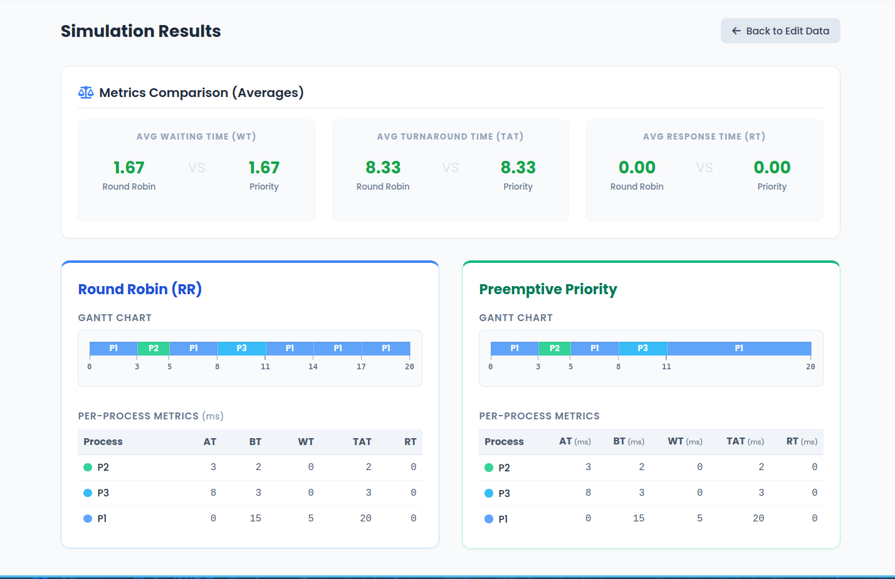
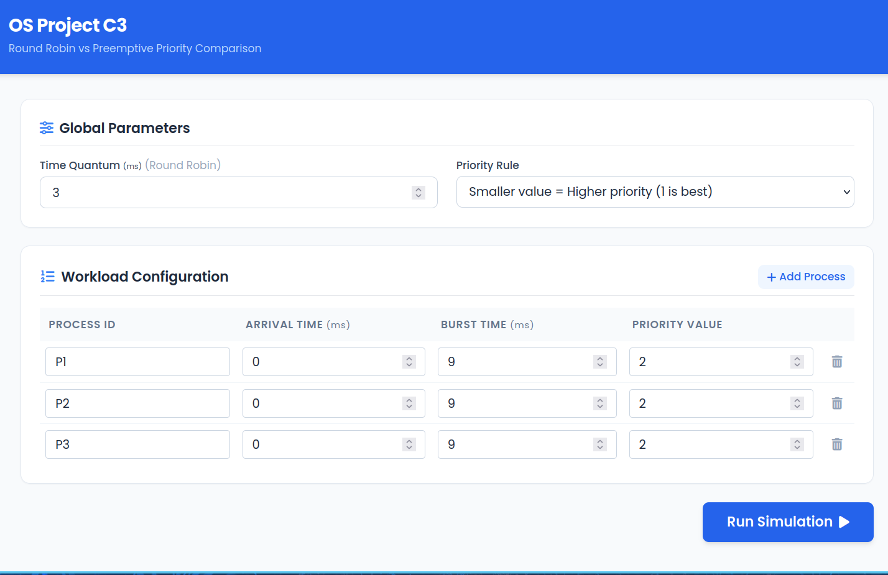
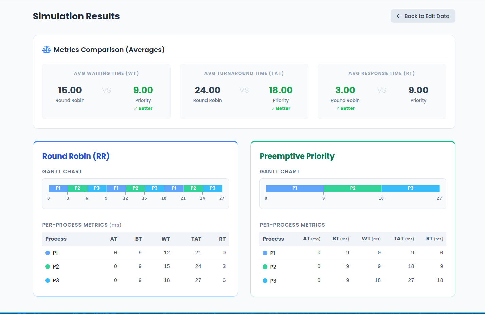
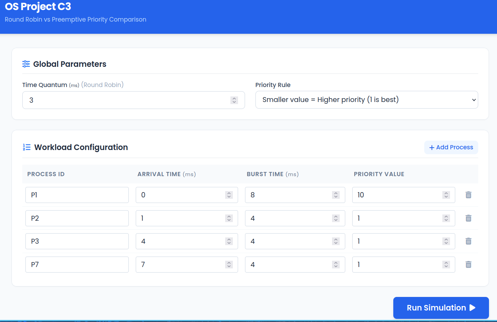
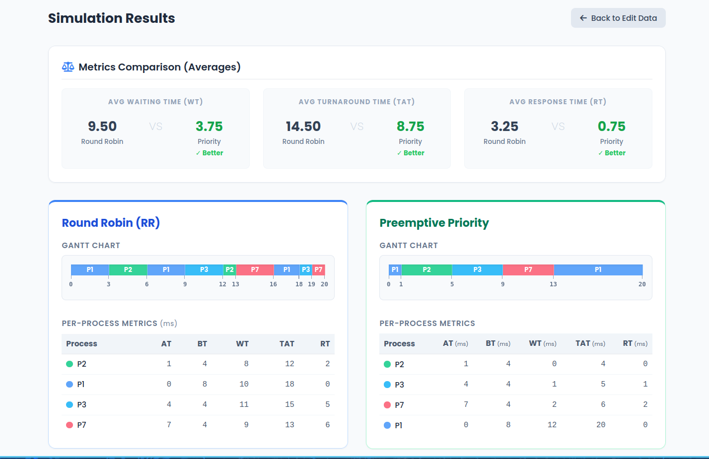
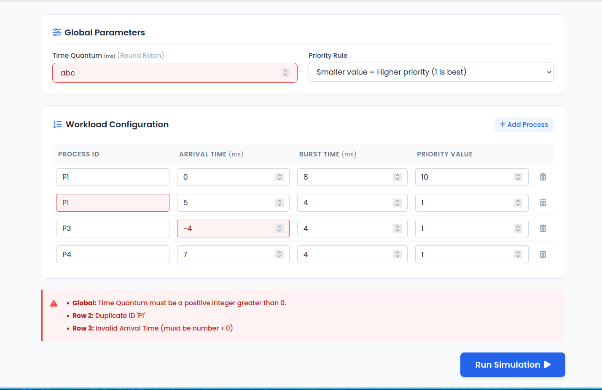

# Operating Systems Project: Round Robin vs Priority Scheduling

This repository contains the simulator for the Operating Systems course project (C3: Round Robin vs Priority). The goal of this project is to simulate and compare the performance, fairness, and starvation risks of a Round Robin scheduler versus a Preemptive Priority scheduler using a unified workload.

## Architecture

This project uses a real-time **CLI Pipeline** architecture to separate the core algorithms from the user interface:

1. **Frontend (HTML/JS/CSS):** A web interface hosted in the `static/` directory that handles user input, strict validation, and rendering Gantt charts/results tables.
2. **Middleware (Python/Flask):** A lightweight API (`app.py`) that serves the webpage, catches the frontend's data, and passes it directly to the C++ core.
3. **Backend (C++):** The core scheduling engine (`main.cpp`). It reads a JSON string from standard input, runs both algorithms, and prints the results as a JSON string to standard output.

## Prerequisites

Every team member needs the following installed on their system (Windows or Linux):

- **Git**
- **C++ Compiler**
- **CMake**
- **Python 3.x**

## Setup & Installation

### 1. Clone the Repository

```
git clone https://github.com/MalekAbido/Round-Robin-vs-Priority-Scheduling-Analysis.git
cd Round-Robin-vs-Priority-Scheduling-Analysis

```

### 2. Set Up the Python Virtual Environment

To keep dependencies clean, we use a virtual environment.

**Linux/macOS:**

```
python3 -m venv flaskenv
source flaskenv/bin/activate
pip install -r requirements.txt

```

**Windows:**

```
python -m venv flaskenv
flaskenv\Scripts\activate
pip install -r requirements.txt

```

### 3. Build the C++ Backend

Use CMake to compile the C++ scheduling engine. This step works exactly the same on Linux and Windows.

```
mkdir build
cd build
cmake ..
cmake --build .
cd ..

```

## Running the Simulator

Whenever you want to test the application, make sure your virtual environment is activated, then start the Flask server:

```
python app.py

```

Open your web browser and go to **`http://localhost:5000`** .

_(Note: As you make changes to the HTML/JS, you can just refresh the browser. If you make changes to the C++ code, you must rerun `cmake --build .` inside the `build` folder)._

## Data Contract (JSON Schemas)

For the frontend and backend teams to work independently, we enforce a strict JSON data structure.

### Input Data Example (Sent from UI to C++ `stdin`)

```
{
  "time_quantum": 4,
  "priority_rule": 0, // 0="lower_is_higher", 1="larger_is_higher"
  "processes": [
    {
      "process_id": "P1",
      "arrival_time": 0,
      "burst_time": 8,
      "priority": 3
    }
  ]
}

```

### Output Data Example (Printed from C++ `stdout` to UI)

```
{
  "round_robin": {
    "gantt_chart": [
      {"process_id": "P1", "start_time": 0, "end_time": 4}
    ],
    "metrics": [
      {"process_id": "P1", "waiting_time": 8, "turnaround_time": 16, "response_time": 0}
    ],
    "averages": {
      "avg_wt": 7.00,
      "avg_tat": 14.00,
      "avg_rt": 3.00
    }
  },
  "priority_preemptive": {
    "gantt_chart": [
      {"process_id": "P1", "start_time": 0, "end_time": 1}
    ],
    "metrics": [
      {"process_id": "P1", "waiting_time": 13, "turnaround_time": 21, "response_time": 0}
    ],
    "averages": {
      "avg_wt": 5.33,
      "avg_tat": 12.33,
      "avg_rt": 1.00
    }
  }
}

```

---

## [Project Document](https://docs.google.com/document/d/1RxmlURjhDDVdvMoMfgOwmid1QUbdH0aRCojOlZzLFDQ/edit?tab=t.o2bidvta3cfm)

---

## Scheduling Algorithms & Metrics Calculations

### Scheduling Algorithms

- **Round Robin (RR)**
  A preemptive algorithm that cycles CPU access among processes using a fixed Time Quantum.
  - **Time Quantum:** The maximum continuous time a process can occupy the CPU before preemption.
  - **Queue Rotation:** Processes are managed in a circular FIFO queue. Upon quantum expiration, the running process is moved to the tail, and the next process at the head is allocated the CPU.
  - **Arrival Handling:** Processes arriving during a context switch are appended to the ready queue; if a process is preempted at the same instant a new one arrives, the new arrival is typically queued first to maintain fairness.

- **Preemptive Priority**
  An algorithm that ensures the process with the highest priority level (implementation-defined as either the lowest or highest numerical value) always has CPU control.
  - **Preemption:** If a newly arrived process has a higher priority than the currently executing one, the scheduler immediately preempts the running task and switches context to the new process.
  - **Resumption:** Preempted processes return to the ready queue and resume execution only when they once again hold the highest priority among all ready tasks.

### Metrics Calculations

The simulator evaluates performance using the following standard mathematical formulas:

- **Turnaround Time (TAT)**
  The total time elapsed from process arrival to completion.

  > **TAT = Completion Time - Arrival Time**

- **Waiting Time (WT)**
  The total time a process spends in the ready queue without CPU execution.

  > **WT = Turnaround Time - Burst Time**

- **Response Time (RT)**
  The duration between process arrival and the first instance of CPU allocation.
  > **RT = First CPU Allocation Time - Arrival Time**

---

## Required Test Scenarios

**Global Configuration for all test scenarios:**

- **Time Quantum:** 3
- **Priority Rule:** Smaller value = Higher priority

### Scenario A: Basic Mixed Workload

- **Purpose:** Prove the baseline correctness of both algorithms.
- **Workload:**
  ```text
  P1: Arrival=0, Burst=6, Priority=3
  P2: Arrival=2, Burst=4, Priority=1
  P3: Arrival=4, Burst=2, Priority=4
  P4: Arrival=5, Burst=5, Priority=2
  ```




### Scenario B: Urgency Case

- **Purpose:** Prove that Preemptive Priority interrupts long tasks for critical ones.
- **Workload:**
  ```text
  P1: Arrival=0, Burst=15, Priority=5
  P2: Arrival=3, Burst=2, Priority=1
  P3: Arrival=8, Burst=3, Priority=2
  ```




### Scenario C: Fairness Case

- **Purpose:** Prove that Round Robin distributes CPU time evenly while Priority executes sequentially.
- **Workload:**
  ```text
  P1: Arrival=0, Burst=9, Priority=2
  P2: Arrival=0, Burst=9, Priority=2
  P3: Arrival=0, Burst=9, Priority=2
  ```




### Scenario D: Starvation Case

- **Purpose:** Prove that a low-priority process gets infinitely delayed in Priority Scheduling, but eventually finishes in Round Robin.
- **Workload:**
  ```text
  P1: Arrival=0, Burst=8, Priority=10
  P2: Arrival=1, Burst=4, Priority=1
  P3: Arrival=4, Burst=4, Priority=1
  P4: Arrival=7, Burst=4, Priority=1
  ```




### Scenario E: Validation Case

- **Purpose:** Prove the frontend validation prevents illegal simulator states.
  ```text
  Actions: Attempt to run the simulation with:
  A negative Burst Time (e.g., -5).
  Two processes with the exact same ID (e.g., "P1" and "P1").
  Letters in the Time Quantum field (e.g., "abc").
  ```



---

## Comparison Focus

### Fairness versus Urgency

The fundamental trade-off between Round Robin and Preemptive Priority scheduling lies in how they balance system fairness against task urgency. Round Robin is designed as a time-sharing system where fairness is the primary metric; it ensures that CPU time is distributed democratically among all ready processes regardless of their function. Conversely, Priority scheduling abandons fairness to enforce a strict hierarchy, guaranteeing that critical tasks receive immediate CPU access at the expense of less important operations.

### How Priority Changes Execution Order

In a standard Round Robin setup, the execution order is strictly determined by arrival time (FCFS)—processes join the back of the ready queue and wait their turn. Priority scheduling dynamically alters this order. When a new process arrives, the scheduler evaluates its assigned priority integer. If it holds a higher urgency than the currently executing process, the scheduler preempts the running task, effectively restructuring the execution queue on the fly based on system importance rather than chronological arrival.

### Whether Urgent Processes Benefit Significantly

Urgent processes see a massive benefit under Priority scheduling. As demonstrated in Scenario B (Urgency Case), when a critical process arrives while a lengthy, low-priority process is executing, the Preemptive Priority algorithm immediately hands over the CPU, resulting in a near-zero response time for the critical task. Under Round Robin, that same urgent process would be forced to wait in the queue for the current time quantum to expire, creating an unacceptable delay for time-sensitive operations.

### Whether Low-Priority Processes May Suffer Starvation

While Priority scheduling handles urgency well, it introduces a severe flaw: starvation. As proven in Scenario D (Starvation Case), if a system experiences a continuous influx of high-priority processes, a low-priority process will be repeatedly pushed to the back of the queue. In our simulation, the lowest-priority process was infinitely delayed. This confirms that without an aging mechanism, strict Priority scheduling will completely starve low-priority tasks under heavy workloads.

### Whether Round Robin Gives More Balanced Service

Round Robin consistently provides a more balanced and predictable service across all processes. As shown in Scenario C (Fairness Case), when multiple processes arrive simultaneously, Priority scheduling forces them to execute sequentially, causing severe delays for the processes at the end of the line. Round Robin, utilizing a fixed time quantum, cycles through all processes quickly. This guarantees that every process receives its first slice of CPU time early, resulting in a balanced average response time and preventing massive, CPU-bound processes from monopolizing the system.

---

## Required Analysis Questions:

### 1 - Which algorithm gave a better average waiting time?

Preemptive Priority scheduling consistently produced a better (lower) average waiting time. Because it allows critical or shorter processes to jump the queue and finish executing entirely, it reduces the overall accumulation of wait time in the system. In contrast, Round Robin forces all processes to wait in the ready queue after every time quantum (3ms), significantly increasing the total wait time for longer processes as they are repeatedly cycled through the queue.

### 2 - Which algorithm gave better response time?

Round Robin provided a better average response time, especially evident in scenarios with simultaneous arrivals (Scenario C). Because the CPU time is sliced, every process in the ready queue receives its first burst of execution very quickly. In Preemptive Priority, a low-priority process might not receive its first CPU cycle until all higher-priority tasks have completely finished, leading to extremely poor response times for processes at the bottom of the hierarchy.

### 3 - Did higher-priority processes gain significant advantage?

Yes, the advantage was absolute. In Scenario B (Urgency Case), the high-priority process (P2) arrived at 3ms and immediately preempted the low-priority process (P1) that was currently running. P2 finished its entire burst with zero waiting time after its arrival. Under Round Robin, P2 was forced to wait its turn in the circular queue behind P1, delaying its completion despite its critical urgency.

### 4 - Did Round Robin appear more balanced across all processes?

Yes, Round Robin demonstrated perfect system balance and fairness. In Scenario C (Fairness Case), where three equal-length processes arrived simultaneously, Round Robin distributed the CPU evenly, advancing all three processes concurrently and ensuring no single process controlled the system. Under Priority scheduling, because the priorities were equal, the algorithm fell back to First-Come-First-Serve (FCFS) logic, forcing the third process to wait completely idle for 18ms before receiving any CPU time.

### 5 - Was starvation observed or likely in Priority Scheduling?

Starvation was heavily observed in Priority Scheduling during Scenario D. The lowest-priority process (P1, Priority 10) was continuously pushed back in the queue as newer, high-priority (Priority 1) processes arrived. P1 was completely stalled and could not make progress until the entire stream of higher-priority tasks was exhausted. In a real-world operating system with a continuous influx of tasks, P1 would effectively be starved indefinitely under this strict priority model.

### 6 - Which algorithm would you recommend for the tested workload, and why?

A hybrid approach is ideal, Round Robin is recommended if the system is interactive (like a desktop OS) because it guarantees fairness, eliminates starvation, and provides excellent response times to all user applications. However, if the system is a real-time environment (like medical equipment or an industrial controller) where missing a deadline for a critical task is catastrophic, Preemptive Priority must be recommended, as it is the only algorithm that guarantees urgent tasks are handled immediately upon arrival.

---

## Required Conclusion:

### 1 - State which algorithm performed better on the selected datasets.

Overall, Round Robin performed better for general system stability and responsiveness, while Preemptive Priority performed better strictly in terms of minimizing average waiting time and isolating critical tasks.

### 2 - State whether priority-based service improved urgent-task treatment.

Priority-based service definitively improved the treatment of urgent tasks. By utilizing preemption, it successfully halted long, low-importance tasks the millisecond a high-priority task arrived, ensuring critical operations experienced zero unnecessary delay.

### 3 - State whether Round Robin improved fairness.

Round Robin vastly improved fairness across the datasets. By enforcing a strict time quantum, it successfully prevented any single heavy process from monopolizing the CPU, ensuring that all background and foreground processes made steady, simultaneous progress.

### 4 - State whether starvation risk appeared.

Yes, Round Robin demonstrated perfect system balance and fairness. In Scenario C (Fairness Case), where three equal-length processes arrived simultaneously, Round Robin distributed the CPU evenly, advancing all three processes concurrently and ensuring no single process controlled the system. Under Priority scheduling, because the priorities were equal, the algorithm fell back to First-Come-First-Serve (FCFS) logic, forcing the third process to wait completely idle for 18ms before receiving any CPU time.

### 5 - Was starvation observed or likely in Priority Scheduling?

A severe starvation risk appeared exclusively in the Preemptive Priority algorithm. The data clearly showed that low-priority processes can be infinitely delayed by a steady stream of incoming higher-priority tasks, a vulnerability that did not exist in the Round Robin implementation
